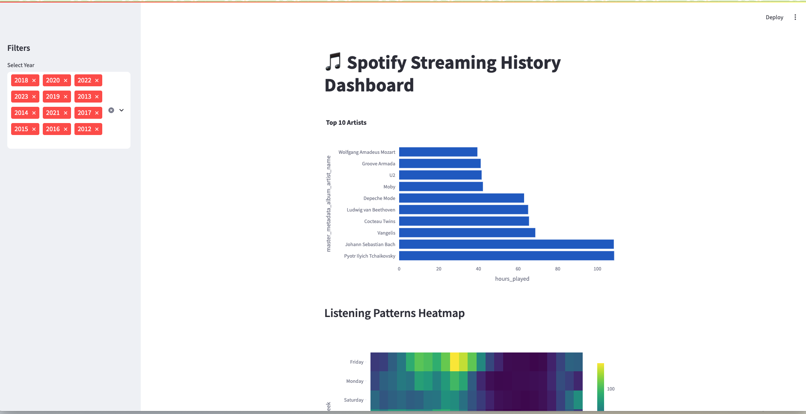
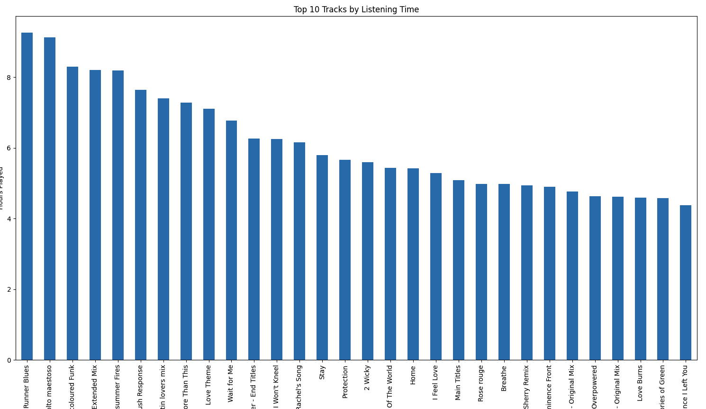
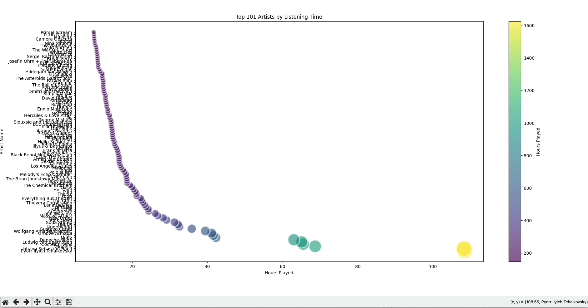

# Spotify Historycal Data Visualization Project
- **Note: This is all my data listening history**
I included 1 JSON file as reference, if you want your data to be visualized certainly you'd need to request it from Spotify. See at the end of the document
This was my 1st experiment visualizating my music listening data with Python, it's somewhat raw and I've made other projects that look much better:

-[My Spotify Data](https://soyroberto.streamlit.app/)- Visual for my listening history. This idea taken to a much better place. The repo: [My Spotify Data](https://github.com/soyroberto/streamlit)
 -[Recommendation system](https://frymusic.streamlit.app/)  - A recommendation system based on my whole listening history. [My own personal recommendation system](https://github.com/soyroberto/mmuffin)

A comprehensive Python-based toolkit for analyzing and visualizing personal Spotify streaming history data. This project provides multiple approaches to explore your music listening patterns through interactive dashboards, static visualizations, and data search capabilities.

## 📊 Project Overview

This repository contains a collection of Python scripts designed to transform raw Spotify streaming data (JSON format) into meaningful insights and beautiful visualizations.  The project offers three main approaches to data analysis:

1. **Interactive Web Applications** - Streamlit dashboard and Panel-based search interface
2. **Static Visualizations** - Matplotlib and Seaborn charts with enhanced aesthetics  
3. **Interactive Plots** - Plotly-powered charts with hover functionality and zoom capabilities
   
The analysis focuses on temporal patterns, artist preferences, track popularity, and listening behavior across different time periods. All scripts are designed to work with Spotify's official data export format, making it easy to analyze your personal listening history.






## 🚀 Features

The primary visualization script that creates a complete set of static and interactive charts for Spotify data analysis. This script serves as the foundation for understanding your listening patterns through multiple visualization types.

**Key Visualizations:**
- **Monthly Listening Time Series**: A line plot showing total listening hours per month over time, helping identify seasonal patterns and long-term trends in your music consumption
- **Daily Listening Heatmap**: A color-coded matrix displaying listening intensity across days of the week and hours of the day, revealing your daily listening habits
- **Monthly Activity Heatmap**: An annual overview showing total listening hours for each month, useful for identifying peak listening periods throughout the year
- **Top 30 Tracks Bar Chart**: Horizontal bar chart ranking your most-played tracks by total listening time
- **Top 50 Artists Bar Chart**: Similar ranking for artists, showing your musical preferences and loyalty patterns
- **Interactive Artist Scatter Plot**: A Plotly-powered scatter plot of your top 101 artists with hover functionality, color-coded by listening time using the viridis color scheme

**Technical Implementation:**
The script processes JSON files from my Spotify data export, converts timestamps to datetime objects, and calculates listening time in hours. It uses seaborn's "whitegrid" style for consistent aesthetics across matplotlib plots, while the interactive scatter plot leverages Plotly Express for enhanced user interaction.

- JSON data loading and preprocessing
- Time-based feature extraction (hour, day of week, month, year)
- Conversion from milliseconds to hours for listening time
- Basic visualization creation using matplotlib and seaborn
- Data aggregation and grouping operations


**Visual Design Elements:**
- **X-axis**: Hours played (ranging from 0 to 100+ hours)
- **Y-axis**: Artist names, arranged vertically for easy reading
- **Color Coding**: Viridis color scale representing listening intensity, with darker colors indicating higher listening times
- **Interactive Tooltips**: Hover functionality revealing exact listening hours and artist names


The Streamlit dashboard represents the pinnacle of user-friendly data exploration in this project. The interface combines multiple visualization types into a cohesive, interactive experience that allows for real-time data filtering and analysis.

**Top 10 Artists Visualization:**
The main content area features a horizontal bar chart displaying the top 10 artists by listening time. The chart shows:
- **Pyotr Ilyich Tchaikovsky**: Leading with approximately 100+ hours
- **Johann Sebastian Bach**: Close second with similar listening time
- **Vangelis**: Significant listening time in the 60-80 hour range
- **Cocteau Twins**: Moderate listening time
- **Ludwig van Beethoven**: Classical music representation
- **Depeche Mode**: Electronic/alternative music presence
- **Moby**: Electronic music representation
- **U2**: Rock music inclusion
- **Groove Armada**: Electronic/dance music
- **Wolfgang Amadeus Mozart**: Classical music completion

**Listening Patterns Heatmap:**
Below the artist chart, the dashboard displays a sophisticated heatmap showing listening patterns across different dimensions:
- **Y-axis**: Days of the week (Monday through Friday visible)
- **X-axis**: Time periods or hours
- **Color Scale**: Intensity from 0 to 100 using a viridis-style color scheme
- **Interactive Elements**: Hover tooltips and zoom capabilities

While not directly shown in the provided screenshots, the codebase reveals several temporal analysis visualizations that provide crucial insights into listening behavior over time:

**Monthly Listening Time Series:**
This visualization tracks total listening hours across months, revealing seasonal patterns and long-term trends. The implementation includes:
- Line plots with enhanced styling using seaborn themes
- Custom tick labels showing month/year combinations
- Value annotations for peak listening periods
- Color gradients reflecting listening intensity

**Daily Activity Heatmaps:**
These heatmaps reveal when you're most likely to listen to music throughout the week and day:
- 7x24 grid showing days of week versus hours of day
- Color intensity representing listening activity
- Clear identification of peak listening times
- Weekend versus weekday pattern analysis

**Annual Overview Heatmaps:**
Yearly summaries showing listening patterns across months:
- 12-month overview with total hours per month
- Year-over-year comparison capabilities
- Seasonal trend identification
- Holiday and vacation period analysis

## 🛠️ Installation and Setup

### Prerequisites

Ensure you have Python 3.7 or higher installed on your system. The project has been tested with Python 3.8+ for optimal compatibility.

### Required Libraries Installation

```bash
pip install pandas matplotlib seaborn plotly streamlit panel mplcursors
```

### Spotify Data Export Setup

1. **Request Your Data**: Visit [Spotify Privacy Settings](https://www.spotify.com/account/privacy/) and request your extended streaming history
2. **Download Process**: Spotify will email you when your data is ready (typically 5-30 days)
3. **File Preparation**: Extract the downloaded ZIP file and locate the JSON files containing your streaming history
4. **Directory Setup**: Create a directory structure and place your JSON files in a folder accessible to the scripts

### Configuration

Update the `json_dir` variable in each script to point to your Spotify data directory:

```python
json_dir = '/path/to/your/spotify/data/'
```


